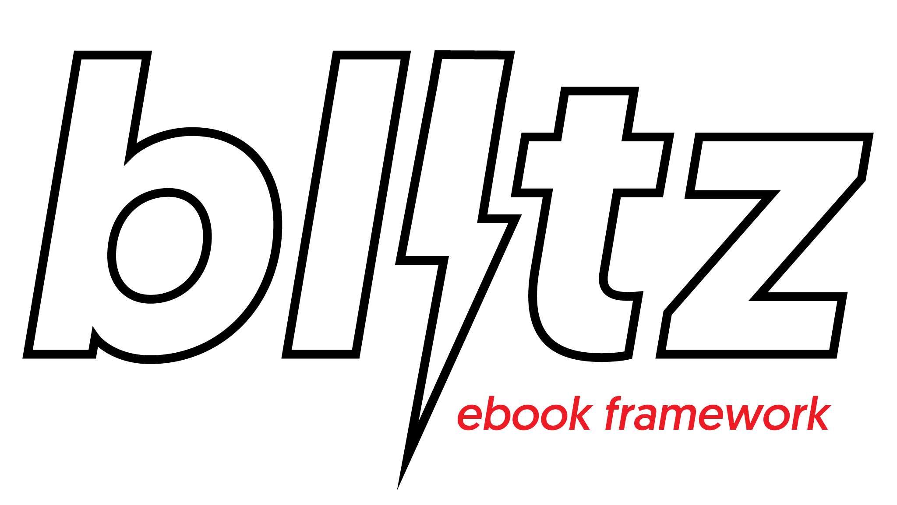

# Blitz eBook Framework

An eBook framework (CSS + template) whose mantra is “finding simple solutions to complex issues.”

## Important Note

We’re in the process of sunsetting the entire Blitz Project, which means this repository will reach End of Life and be archived as read-only on September 1, 2020. Don’t worry, all current and future forks will continue to work after this date.

If you are interested in the sunsetting roadmap, or taking over this repository’s maintenance and development, please [check the related meta issue in Blitz](https://github.com/FriendsOfEpub/Blitz/issues/66).

Call for new maintainers ends June 15, 2020.

## Licence 

Blitz is released under [MIT Licence](https://github.com/FriendsOfEpub/Blitz/blob/master/LICENSE) © 2016, Jiminy Panoz.

## Support

- Readium SDK
- Adobe RMSDK
- iBooks
- Kobo
- Google Play Books
- Kindle (mobi7 + KF8)

## How to Use

There are various ways to use blitz, from adding the available stylesheets (`CSS` folder) to building them with the LESS framework.

### Use the Provided Stylesheets

You can either add `blitz.css` or an alternative stylesheet in your EPUB file.

`blitz.css` is commented but you’ll find an uncommented version in the `AltStylesheets` folder (which helps you save some 7kb).

In this folder, you’ll also find `blitz-lite.css` and `blitz-reset.css` (normal + minified).

1. `blitz-lite.css` should be enough for simple books like novels and essays (it’s 3kb);
2. `blitz-reset.css` is just… the reset we’ve designed (it’s 1kb).

Add styles on top of those two is up to you… But you’ll then miss the powerful tools we’ve built in LESS!

### Install and Compile With npm

First go to the blitz root directory and install the dev dependencies: 

```
npm install
```

Then make your changes in LESS and run:

```
npm run build
```

This will compile the LESS src to the default, lite and reset stylesheets, and update the template.

If you want to compile only one stylesheet you can run:

- `build:default` for the default output (`blitz.css`) – that will update the template’s unzipped src too;
- `build:lite` for the lite output (`blitz-lite.css`);
- `build:reset` for the reset output (`blitz-reset.css`);

All those sub-builds will generate uncommented/minified files as well.

Finally, to update the packaged EPUB file then use `npm run make`.

### Compile LESS Sources Without npm

Either use the [GUI](http://lesscss.org/usage/#guis-for-less) or, if you’re one of the old-school type…

#### For Default

```
lessc Blitz_framework/LESS/blitz.less Blitz_framework/CSS/blitz.css
```

#### For Lite

```
lessc Blitz_framework/LESS/blitz-lite.less Blitz_framework/CSS/AltStylesheets/blitz-lite/blitz-lite.css
```

#### For Reset

```
lessc Blitz_framework/LESS/blitz-reset.less Blitz_framework/CSS/AltStylesheets/blitz-reset/blitz-reset.css
```

## Related Blitz Tools

- [Blitz Tasks](https://github.com/FriendsOfEpub/blitz-tasks) – a set of gulp scripts to automate (X)HTML markup changes and apply some useful optimizations
- [blitzck-cli](https://github.com/FriendsOfEpub/blitzck-cli) – EPUB Reading Systems’ support, mimetypes, namespaces, and ARIA mappings from the command line interface
- [The eBook Design Checklist](https://friendsofepub.github.io/eBookDesignChecklist/) – a progressive web app to help you design eBooks
- [The eBook Performance Checklist](https://friendsofepub.github.io/eBookPerfChecklist/) – a progressive web app to help you boost eBook performance
- [Blitz eBook Tricks](https://friendsofepub.github.io/eBookTricks/) – a collection of CSS snippets to help you do progressive enhancement in eBooks

## Design & Goals

Blitz was designed to deal with the significant obstacles a newcomer or even an experienced producer might encounter. Its major goals are:

1. to be simple and robust enough;
2. to offer a sensible default;
3. to manage backwards compatibility (ePub 2.0.1 + mobi 7);
4. to provide useful tools (LESS);
5. to get around reading modes (night, sepia, etc.);
6. to **not** disable user settings.

We have chosen a functional approach (FCSS) but LESS presets are planned to provide meaningful class names depending on eBook’s type (poetry, plays, etc.).

### The 4 Principles of Blitz

1. **Espouse [inheritance and the cascade](https://www.w3.org/wiki/Inheritance_and_cascade)**, the 2 fundamental principles of CSS. eBooks are documents, CSS was designed for documents… It’s a match! 
2. **Build and refine**, don’t style and undo. Don’t override your own styles, create reusable components—the reset should help you do that.
3. **Don’t fight, skirt.** Be smart, it’s not worth fighting RS’ default stylesheets (their selectors and !importants are too much hassle), *trompe le monde.*
4. **Have fun!** We’ve done our utmost to help you avoid common pitfalls. You don’t have to deal with the crappiest parts of eBook CSS authoring, sit back and relax.

### Useful Details

Blitz is leveraging the concept of inheritance. Values `inherit` and `currentColor` are being used extensively to make the framework compatible with Reading Systems’ default stylesheets, reading modes (`color`) and user settings (`font-size`, `font-family`, `line-height`, etc.).

Defaults and a reset do the heavy lifting so it’s just about building on top of this base. Please note Blitz is taking care of defaults RS aren’t necessarily (HTML5 block elements, hyphens and pagebreaks for selected elements, etc.).

Finally, although we try to rely on RS’ typefaces, typography has been fine tuned.

- The default scale has been chosen to handle various situations well enough (screen/container size, user increasing `font-size`, typeface used, etc.)
- Vertical rhythm (`line-height` + `margin` and `padding`) is automatically computed in LESS to enforce consistency. By taking care of vertical rhythm, we’re also achieving horizontal harmony when the eBook is rendered on a (fake) spread: “everything text” lines up on the same baseline grid, which makes for a more comfortable reading experience.
- `sup` and `sub` styling is improved to prevent them from affecting line-height.
- The whole [§8. Breaking Within Words](https://drafts.csswg.org/css-text-4/) is implemented in LESS.

To sum up, we’ve tried to find a balance and feel like Blitz defaults can help producers get around a lot of possible issues: we don’t need hacks, we don’t have to change values in specific situations using complex media queries.

### Related EPUB 3.1 issues

- The EPUB 3.1 spec should address common reader styling scenarios [#671](https://github.com/IDPF/epub-revision/issues/671)
- Defining a minimal default stylesheet in the epub spec [#672](https://github.com/IDPF/epub-revision/issues/672)
- Media Queries [#685](https://github.com/IDPF/epub-revision/issues/685)
- Possible spec language for reading system CSS handling [#693](https://github.com/IDPF/epub-revision/issues/693)

### Browserlist we’re using for progressive enhancements

The following is a list of browsers/rendering engines modern EPUB apps are using behind the scenes. It is using the [browserlist format](https://github.com/browserslist/browserslist) and can be imported in websites such as [CanIUse](https://caniuse.com/#browserset_select).

```
ie >= 11
edge >= 14
last 4 chrome major versions
safari >= 9.1
ios_saf >= 9.3
android >= 4.4
last 2 and_chr major versions
```

Alternatively, you can use [this CanIuse Link](https://caniuse.com/?browserset=ie%20%3E%3D%2011%2Cedge%20%3E%3D%2014%2Clast%204%20chrome%20major%20versions%2Csafari%20%3E%3D%209.1%2Cios_saf%20%3E%3D%209.3%2Candroid%20%3E%3D%204.4%2Clast%202%20and_chr%20major%20versions).

When checking for support, you can simply click “Apply Filters” in order to display those browsers in the support table.

#### Some more details

- IE 11’s Trident is used by some Windows app like Adobe Digital Editions 4.5
- Edge is aligned with the release of the eBook Reader in the Edge browser
- Safari on MacOS is aligned with the release of iBooks on Mavericks (10.9)
- Safari on iOS is starting at iOS 9.3
- Android 4.4.4 is still used by some apps on Android while others are using the more modern WebView (2 last Android versions)

## Frequently Addressed Questions

### Is this project still active?

Nope.

We sunset Blitz in 2020. See [the meta issue in Blitz](https://github.com/FriendsOfEpub/Blitz/issues/66) for further details

We deemed Blitz feature-complete though, and it should consequently be still useful for a couple of years.

### Has anyone funded this project?

Nope. 

It grew organically out of the desire to learn CSS preprocessors, then improve at JavaScript and make Progressive Web Apps, etc. It just seemed that side projects sharing knowledge that would be useful to the ebook production community was the best way to achieve those goals.

At some point, sponsoring was considered but quickly dismissed due to the relatively small size of the ebook production community: it was simply too much to ask.

### Which features did not make it into the framework?

Quite a lot, actually.

- Building an online CSS generator in the form of a website where people would answer questions, and a stylesheet would be created based on those answers.
- Presets for different genres of books.
- Poor man’s Dev Tools.
- A JavaScript library of interactive widgets.
- Automated scripts to update ePub2 files to EPUB3, convert `epub:type` to DPUB ARIA, clean DTP outputs’ markup, etc. (would have required GUI since everyone is not comfortable with the command-line and npm).
- A CanIUse-like service.
- etc.

But maybe *you* could successfully build a business out of that list…

### What is missing in version 1?

Better internationalization.

By improving support for the 24 additonal languages we added at some point, Blitz would better cover the needs and requirements of 3,049,150,507 speakers.

### Why was JS abandoned?

JavaScript has quite a bad reputation in publishing, especially as Kindle and eReaders relying on Adobe’s RMSDK don’t support it. So it was not worth pursuing JavaScript exploration despite [all the Research and Development that had gone into it](https://jaypanoz.github.io/ebookcraft2017).

A library of custom elements almost happened after successful initial testing, but one careful review later, it was clear most authors wouldn’t even bother trying such a library. That wasn’t a hill to die on when most authors want Reading Systems to handle that out of the box.

### How to leverage the LESS meta-language?

[Check this tutorial](https://friendsofepub.github.io/Blitz/documentation/tutorial.html).

## Log

### 1.5.1

- Created a `.line-through` static mixin in utilities
- Improved consistency of mixin usage in LESS

### 1.5.0

With massive props to [@ptmkenny](https://github.com/ptmkenny) for internationalization and config improvements.

- Improved and completed `text-emphasis` for Japanese
- Implemented ruby text in default for Japanese
- Implemented `min-light-height` as a variable (for Kindle)
- Implemented a font-family variable for a custom headings selector
- Fixed list style type for Kindle
- Made asterism path a global variable
- Made link color a separate variable
- Made font stacks global variables so that they can be reused in the codebase
- Made Kindle output a flag users can enable/disable (`@handle-kindle`)

### 1.4.1

- Fixed `padding-left` for lists (switched to relative `ems`) so that markers can’t be cropped

### 1.4.0

- Added internationalization reference to the LESS framework

### 1.3.0

- Moved Kindle Media Queries and styles into core
- Removed other MQs

### 1.2.4

- Corrected tables’ cell padding (switched back to `px` value instead of `%` as it depended on RSs’ forcing a relayout)
- Disabled a11y metadata in an attempt to provide a reasonable default

### 1.2.3

- Corrected KF8’s bug where `page-break-inside: avoid` can create a blank

### 1.2.2

- Corrected Mobi7 font size for `.small-caps`

### 1.2.1

- Corrected `.small-caps` and created a new `.caps-to-small-caps` util

### 1.2.0

- Progressive enhancements plugin is now implemented at the core of the LESS framework:
    - removed support for [font-variant-alternates](https://www.w3.org/TR/css-fonts-4/#font-variant-alternates-prop);
    - removed [font-feature-settings](https://www.w3.org/TR/css-fonts-4/#font-rend-desc) properties;
    - corrected negative (`not`) feature queries
- Automated build with npm

### 1.1.3

- Removed gap after images
- Added DPUB ARIA roles in template

### 1.1.2

- Fixed hyphenation (limit chars)

### 1.1.1

- added reset styles for `hidden` attribute to improve backwards compatibility;
- added a utility for `list-style-type: none`;
- an experimental plugin for progressive enhancements is now available ([check docs](https://github.com/FriendsOfEpub/Blitz/blob/master/Blitz_framework/LESS/plugins/blitz_progressive-docs.md)). 

### 1.1.0

- Added plugin for progressive enhancements.

### 1.0.1

- improved `hr.transition` (won’t screw up vertical rhythm because margins any longer);
- `-webkit-locale` now an override (issue #9).

### 0.9.5 (Pre-release) -> 1.0.0 (stable)

- refacto making the framework much easier to handle and customize (typo is now barebones)
- asterism is now an SVG background (beware! it’s an external dependency)
- CSS has been fine-tuned (e.g. `limit-lines`, tabular numerals, `object-fit`, etc.)
- added mixins to override and customize `list-style-type`
- prevented blank page at the end of xhtml in reset
- initialized docs (vanilla docs + API flavored reference)
- containers’ and images’ classes in `vh` are now available
- corrected epub namespace
- completed utilities (margins, underline, etc.)
